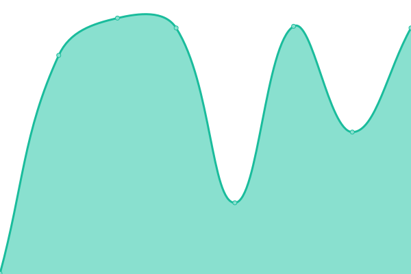

# [📈 Live Status](https://demo.upptime.js.org): <!--live status--> **🟧 Partial outage**

This repository contains the open-source uptime monitor and status page for [Upptime](https://upptime.js.org), powered by [Upptime](https://github.com/upptime/upptime).

With [Upptime](https://upptime.js.org), you can get your own unlimited and free uptime monitor and status page, powered entirely by a GitHub repository. We use [Issues](https://github.com/upptime/upptime/issues) as incident reports, [Actions](https://github.com/jurian360/pulse/actions) as uptime monitors, and [Pages](https://demo.upptime.js.org) for the status page.

<!--start: status pages-->
<!-- This summary is generated by Upptime (https://github.com/upptime/upptime) -->
<!-- Do not edit this manually, your changes will be overwritten -->
<!-- prettier-ignore -->
| URL | Status | History | Response Time | Uptime |
| --- | ------ | ------- | ------------- | ------ |
|  [p1](https://edge-gw.onadept.com/p1) | 🟩 Up | [p1.yml](https://github.com/jurian360/pulse/commits/HEAD/history/p1.yml) | 

 597ms
     
 | 

<a href="https://jurian360.github.io/pulse/history/p1">100.00%</a>
    

|  [p2](https://edge-gw.onadept.com/p2) | 🟩 Up | [p2.yml](https://github.com/jurian360/pulse/commits/HEAD/history/p2.yml) | 

 1980ms
     
 | 

<a href="https://jurian360.github.io/pulse/history/p2">100.00%</a>
    

|  [p3](https://edge-gw.onadept.com/p3) | 🟩 Up | [p3.yml](https://github.com/jurian360/pulse/commits/HEAD/history/p3.yml) | 

 346ms
     
 | 

<a href="https://jurian360.github.io/pulse/history/p3">100.00%</a>
    

|  [p4](https://edge-gw.onadept.com/p4) | 🟩 Up | [p4.yml](https://github.com/jurian360/pulse/commits/HEAD/history/p4.yml) | 

 3753ms
     
 | 

<a href="https://jurian360.github.io/pulse/history/p4">100.00%</a>
    

|  [p5](https://edge-gw.onadept.com/p5) | 🟩 Up | [p5.yml](https://github.com/jurian360/pulse/commits/HEAD/history/p5.yml) | 

 812ms
     
 | 

<a href="https://jurian360.github.io/pulse/history/p5">100.00%</a>
    

|  [Telegram Alert Test](https://google.invalid) | 🟥 Down | [telegram-alert-test.yml](https://github.com/jurian360/pulse/commits/HEAD/history/telegram-alert-test.yml) | 

 0ms
     
 | 

<a href="https://jurian360.github.io/pulse/history/telegram-alert-test">0.00%</a>
    

<!--end: status pages-->

[**Visit our status website →**](https://demo.upptime.js.org)

## 📄 License

- Powered by: [Upptime](https://github.com/upptime/upptime)
- Code: [MIT](./LICENSE) © [Anand Chowdhary](https://anandchowdhary.com), supported by [Pabio](https://pabio.com)
- Data in the `./history` directory: [Open Database License](https://opendatacommons.org/licenses/odbl/1-0/)
